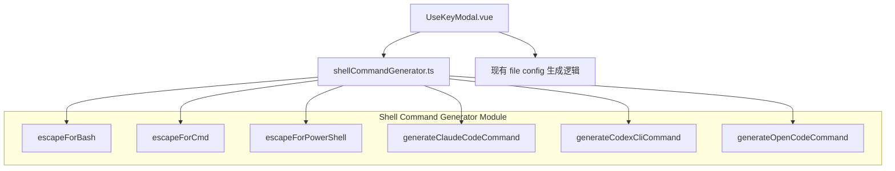
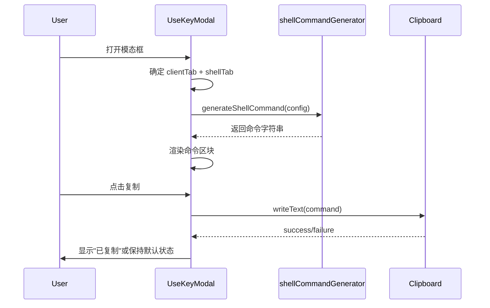

# Design Document: API Key Shell Commands

## Overview

本设计为 UseKeyModal 组件添加 Shell 一键命令功能。用户在每个客户端标签页（Claude Code、Codex CLI、OpenCode）中可以看到一条可复制的 Shell 命令，粘贴到终端即可自动创建目录并写入配置文件。

核心设计决策：
1. **独立模块化**：将 Shell 命令生成逻辑抽取为独立的 `shellCommandGenerator.ts` 工具模块，与 UI 组件解耦
2. **纯函数设计**：命令生成器为纯函数，接收配置参数返回命令字符串，便于测试
3. **Shell 安全性优先**：对所有动态值进行 Shell 特定的转义处理，防止命令注入

## Architecture



### 数据流



## Components and Interfaces

### 1. Shell Command Generator Module (`src/utils/shellCommandGenerator.ts`)

```typescript
// Shell 环境类型
export type ShellType = 'bash' | 'cmd' | 'powershell'

// 客户端类型
export type ClientType = 'claude' | 'codex' | 'codex-ws' | 'opencode' | 'gemini'

// 命令生成输入参数
export interface ShellCommandInput {
  clientType: ClientType
  shellType: ShellType
  baseUrl: string
  apiKey: string
  platform: GroupPlatform
}

// 命令生成结果
export interface ShellCommandOutput {
  command: string       // 完整的一键命令
  label: string         // 显示标签（如 "Terminal", "PowerShell"）
}

// 主入口函数
export function generateShellCommand(input: ShellCommandInput): ShellCommandOutput

// Shell 转义函数（导出供测试）
export function escapeForBash(value: string): string
export function escapeForCmd(value: string): string
export function escapeForPowerShell(value: string): string
```

### 2. UseKeyModal.vue 组件变更

**新增 computed 属性：**
- `shellCommand`: 基于当前 `activeClientTab`、`activeTab`（OS/Shell）、`apiKey`、`baseUrl`、`platform` 计算一键命令

**模板变更：**
- 在现有 `currentFiles` 代码块上方添加 Shell 一键命令区块
- 移除 `showShellTabs` 中对 `opencode` 的排除逻辑，使 OpenCode 也显示 OS/Shell 选项卡

**clientTabs 变更：**
- `openai` 平台：Claude Code 始终作为第一个 tab，不再依赖 `allowMessagesDispatch`
- `openai` 平台默认 activeClientTab 改为 `'claude'`

### 3. 接口契约

Shell Command Generator 的核心契约：
- **幂等性**：生成的命令可重复执行，不会因目录已存在而报错
- **内容一致性**：命令写入的文件内容与 `currentFiles` 中显示的内容完全一致
- **安全性**：所有动态值经过 Shell 特定转义，防止注入

## Data Models

### ShellType 映射

| ShellType    | activeTab 值  | 目录创建命令                              | 文件写入方式          |
|-------------|--------------|------------------------------------------|---------------------|
| bash        | unix         | `mkdir -p <dir>`                         | `cat > <file> << 'EOF'` |
| cmd         | cmd / windows| `if not exist "<dir>" mkdir "<dir>"`     | `(echo ...)> <file>` |
| powershell  | powershell   | `New-Item -ItemType Directory -Force -Path <dir>` | `Set-Content -Path <file>` |

### 客户端配置路径

| ClientType | 目录路径                          | 文件                    |
|-----------|----------------------------------|------------------------|
| claude    | `~/.claude` / `%userprofile%\.claude` | `settings.json`        |
| codex     | `~/.codex` / `%userprofile%\.codex`   | `config.toml`, `auth.json` |
| opencode  | `~/.config/opencode` / `%userprofile%\.config\opencode` | `opencode.json` |

### Claude Code settings.json 结构

```json
{
  "env": {
    "ANTHROPIC_BASE_URL": "<baseUrl>",
    "ANTHROPIC_AUTH_TOKEN": "<apiKey>",
    "CLAUDE_CODE_DISABLE_NONESSENTIAL_TRAFFIC": "1"
  }
}
```

当 platform 为 `openai` 时，额外包含：
```json
{
  "env": {
    "ANTHROPIC_BASE_URL": "<baseUrl>",
    "ANTHROPIC_AUTH_TOKEN": "<apiKey>",
    "CLAUDE_CODE_DISABLE_NONESSENTIAL_TRAFFIC": "1",
    "CLAUDE_CODE_ATTRIBUTION_HEADER": "0"
  }
}
```

## Correctness Properties

*A property is a characteristic or behavior that should hold true across all valid executions of a system — essentially, a formal statement about what the system should do. Properties serve as the bridge between human-readable specifications and machine-verifiable correctness guarantees.*

### Property 1: Command structure correctness

*For any* valid `ShellCommandInput` (any combination of `clientType` ∈ {claude, codex, codex-ws, opencode}, `shellType` ∈ {bash, cmd, powershell}, and any non-empty `baseUrl` and `apiKey`), the generated shell command SHALL contain: (a) a directory creation command targeting the correct path for that client, and (b) a file write operation for each expected configuration file for that client.

**Validates: Requirements 3.1, 3.2, 3.3, 4.1, 4.2, 5.2, 5.3, 5.4**

### Property 2: Embedded content validity and consistency

*For any* valid `ShellCommandInput`, the file content embedded within the generated shell command SHALL be parseable by the appropriate parser (JSON for settings.json, auth.json, opencode.json; TOML structure for config.toml) and SHALL be character-for-character identical to the content produced by the existing `currentFiles` display logic for the same input parameters.

**Validates: Requirements 3.6, 4.4, 5.5**

### Property 3: Shell escaping round-trip safety

*For any* arbitrary string (including characters like `$`, `` ` ``, `\`, `!`, `"`, `%`, `&`, `|`, `<`, `>`, `^`, `'`), the shell-specific escape function SHALL produce output that, when interpreted by the target shell's string parsing rules, yields the original unescaped string value.

**Validates: Requirements 7.1, 7.4**

### Property 4: Command safety invariants

*For any* valid `ShellCommandInput` and any `shellType`, the generated command SHALL: (a) use idempotent directory creation (`mkdir -p` for bash, `if not exist ... mkdir` for CMD, `New-Item -ItemType Directory -Force` for PowerShell), (b) quote all file paths, and (c) use truncating write operations (`>` for bash/CMD, `Set-Content` for PowerShell) that overwrite rather than append.

**Validates: Requirements 3.5, 4.5, 7.2, 7.3, 7.5**

### Property 5: Conditional content inclusion

*For any* valid `ShellCommandInput` where `platform` is "openai" and `clientType` is "claude", the embedded JSON content SHALL include the field `"CLAUDE_CODE_ATTRIBUTION_HEADER": "0"`. *For any* valid input where `clientType` is "codex-ws", the embedded config.toml content SHALL include `supports_websockets = true` and a `[features]` section with `responses_websockets_v2 = true`.

**Validates: Requirements 3.4, 4.3**

## Error Handling

### Clipboard Failures

- 如果 `navigator.clipboard.writeText()` 失败（权限被拒绝、非 HTTPS 环境等），不显示"已复制"确认，按钮保持默认状态
- 使用现有的 `useClipboard` composable，它已经处理了 fallback 逻辑

### 特殊字符处理

- API Key 和 Base URL 中的特殊字符通过 Shell 特定转义函数处理
- 如果转义后的命令过长（超过终端行缓冲区限制），仍然生成完整命令，用户可通过复制粘贴使用
- JSON 内容中的特殊字符（如 `"`, `\`）通过 `JSON.stringify` 自动处理

### 平台兼容性

- Windows CMD 的 `echo` 命令对特殊字符（`&`, `|`, `<`, `>`, `^`）需要 `^` 转义
- PowerShell 使用单引号字符串避免变量展开，内嵌单引号通过 `''` 转义
- Bash 使用 heredoc (`<< 'EOF'`) 避免大部分转义问题，仅需处理 heredoc 终止符冲突

## Testing Strategy

### 测试框架

- **单元测试**: Vitest（项目已有配置）
- **属性测试**: [fast-check](https://github.com/dubzzz/fast-check) 与 Vitest 集成
- **组件测试**: @vue/test-utils + Vitest

### 属性测试（Property-Based Tests）

使用 `fast-check` 库进行属性测试，每个属性至少运行 100 次迭代。

**测试文件**: `src/utils/__tests__/shellCommandGenerator.spec.ts`

每个属性测试标注对应的设计属性：
- `// Feature: apikey-shell-commands, Property 1: Command structure correctness`
- `// Feature: apikey-shell-commands, Property 2: Embedded content validity and consistency`
- `// Feature: apikey-shell-commands, Property 3: Shell escaping round-trip safety`
- `// Feature: apikey-shell-commands, Property 4: Command safety invariants`
- `// Feature: apikey-shell-commands, Property 5: Conditional content inclusion`

### 单元测试

**测试文件**: `src/utils/__tests__/shellCommandGenerator.unit.spec.ts`

覆盖以下场景：
- 各平台的 clientTabs 顺序验证（Requirements 1.1-1.6）
- Claude Code 默认 tab 选择
- OpenCode 的 OS/Shell tabs 显示
- antigravity 平台生成多个命令变体
- 空输入或无效输入的边界情况

### 组件测试

**测试文件**: `src/components/keys/__tests__/UseKeyModal.spec.ts`

覆盖以下场景：
- Shell 命令区块在文件显示上方渲染
- 复制按钮交互和"已复制"状态
- Tab 切换时命令重新生成
- 剪贴板失败时的行为

### 测试配置

```typescript
// fast-check 配置
fc.configureGlobal({ numRuns: 100 })
```

### 生成器设计

- `arbitraryBaseUrl`: 生成合法的 URL 字符串（含特殊字符变体）
- `arbitraryApiKey`: 生成包含各种字符的 API key 字符串
- `arbitraryShellType`: 从 `['bash', 'cmd', 'powershell']` 中随机选择
- `arbitraryClientType`: 从 `['claude', 'codex', 'codex-ws', 'opencode']` 中随机选择
- `arbitraryPlatform`: 从 `['openai', 'anthropic', 'gemini', 'antigravity']` 中随机选择

